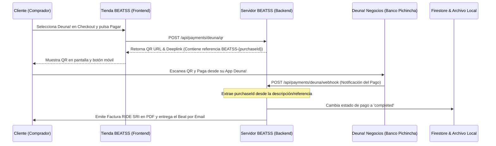

# Guía de Configuración: Webhook de Deuna! Negocios

Esta guía detalla el procedimiento técnico para conectar tu cuenta de **Deuna! Negocios** (asociada a tu RUC) con la plataforma **BEATSS**. Esto habilitará la confirmación automática e instantánea de las licencias y la entrega de beats al comprador en cuanto escaneen y completen el pago de tu código QR dinámico.

---

## ⚙️ ¿Cómo funciona el flujo de cobro automatizado?

El flujo de pago de Deuna! en BEATSS está completamente automatizado y no requiere subir capturas de comprobantes de pago ni intervención manual:



---

## 🛠️ Paso a Paso para Configurar el Webhook

Para que los servidores de Deuna! Negocios le notifiquen a tu plataforma cuando se realiza un pago exitoso, debes registrar la URL de tu webhook en su portal.

### Paso 1: Obtener la URL de tu Webhook
La ruta encargada de procesar las notificaciones de pago de Deuna! en tu backend de BEATSS es:
`https://<tu-dominio-o-tunel-publico>/api/payments/deuna/webhook`

> [!IMPORTANT]
> Si estás realizando pruebas locales en tu máquina, deberás usar un túnel seguro mediante Ngrok o LocalTunnel para exponer tu puerto local `8000` a Internet (ej. `https://xxxx-xx-xx-xx.ngrok-free.app/api/payments/deuna/webhook`). 
>
> Para producción, usa tu dominio oficial o la URL de despliegue donde esté alojado tu servidor.

### Paso 2: Registrar el Webhook en el Portal de Deuna! / Pichincha Developers
1. Inicia sesión en el **Portal de Desarrolladores de Banco Pichincha** ([developer.pichincha.com](https://developer.pichincha.com)) o accede a tu consola de **Deuna! Negocios**.
2. Dirígete a la sección de **Configuraciones de API** o **Webhooks**.
3. Haz clic en **Crear Webhook** o **Agregar Endpoint**.
4. Rellena los campos con la siguiente configuración:
   * **URL de Destino / Endpoint:** `https://<tu-dominio-o-tunel-publico>/api/payments/deuna/webhook`
   * **Eventos a escuchar:** Selecciona únicamente el evento de confirmación de pago exitoso (usualmente denominado `transaction.success`, `payment.completed` o `orden.pagada`).
   * **Formato:** `JSON`.
5. Guarda los cambios. El portal te proveerá un **Secret Token** (opcional, para firma HMAC) que utilizaremos para asegurar el webhook más adelante si decides activar el endurecimiento de firmas.

---

## 🧪 Verificación y Pruebas en Producción

Hemos verificado localmente la compatibilidad del webhook con los esquemas de payload anidados oficiales que envía Banco Pichincha/Deuna! Negocios. El servidor procesa exitosamente payloads con esta estructura:

```json
{
  "event": "transaction.success",
  "data": {
    "reference": "BEATSS-ID_DE_COMPRA",
    "amount": 30.00,
    "status": "approved"
  }
}
```

### ¿Cómo hacer una prueba real?
1. Configura tu número celular y tu nombre registrado en Deuna! dentro de tu **Panel de Productor** en BEATSS.
2. Ingresa a tu tienda pública de beats como si fueras un comprador.
3. Agrega un beat barato al carrito (puedes crear un cupón del 99% de descuento para que el total a pagar sea de centavos, por ejemplo, `$0.10`).
4. Selecciona **Deuna!** como método de pago y completa el checkout.
5. Abre la aplicación de Deuna! en tu teléfono, escanea el QR generado en el navegador y efectúa el pago real de los centavos.
6. En segundos, el webhook notificará a tu servidor, el checkout de la tienda se actualizará automáticamente a "Pago Aprobado", se generará el contrato RIDE PDF con dirección *Quito - Ecuador* y recibirás el archivo del beat por correo.
