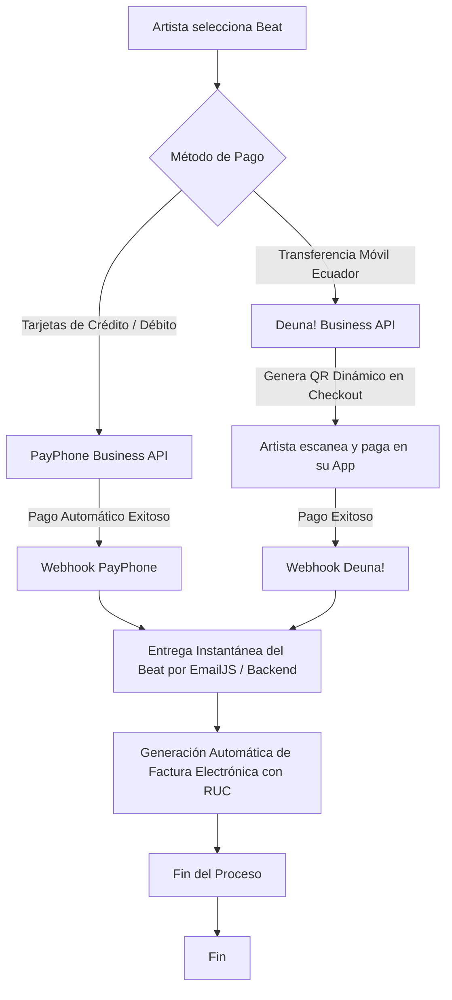

# Opciones de Procesamiento de Pagos en Ecuador al Contar con RUC

Con la formalización tributaria mediante el **Registro Único de Contribuyentes (RUC)** en Ecuador, se desbloquean herramientas avanzadas de procesamiento de cobros locales e internacionales. Este reporte analiza las pasarelas que se habilitan, sus condiciones comerciales, la viabilidad técnica de su integración y una hoja de ruta recomendada para la plataforma **BEATSS**.

---

## 1. Nuevas Opciones de Pago Habilitadas con RUC

Las cuentas personales o informales en Ecuador sufren de límites transaccionales bajos, riesgo de bloqueos preventivos por lavado de activos (UAFE) y la imposibilidad de integrarse con motores de checkout avanzados. El RUC solventa estas limitaciones y permite contratar los siguientes servicios:

### A. PayPhone Business (Corporativo con RUC)
*   **Comisión:** **5% + IVA** (sobre la comisión) por transacciones con tarjeta de crédito/débito. 0% de saldo a saldo de la app PayPhone.
*   **Características Clave:**
    *   **Límites Ampliados:** Eliminación de los topes transaccionales de cuentas personales, permitiendo procesar ventas corporativas de beats exclusivos de alto valor ($500+).
    *   **API de Checkout Estable:** Acceso a credenciales de producción para integrar el botón de pago de forma nativa en la tienda de beats de BEATSS.
    *   **Facturación:** PayPhone emite facturas electrónicas por sus comisiones, lo que permite al productor deducir legalmente estos costos de sus declaraciones de IVA e Impuesto a la Renta.

### B. Deuna! Business (API para QR Dinámico)
Deuna! (del Banco Pichincha) es el medio de pago móvil más rápido y popular en Ecuador. Con RUC, se puede acceder a su suite corporativa:
*   **Comisión:** Comisiones nulas o extremadamente bajas por transferencias inmediatas.
*   **Integración de QR Dinámico:** En lugar del método actual donde el comprador debe transferir manualmente, subir una captura de pantalla y esperar aprobación, la API de Deuna! permite generar un **código QR dinámico** en el checkout con el valor exacto de la compra.
*   **Webhooks de Aprobación:** Al escanear y pagar desde la app de Deuna!, la API notifica mediante un webhook en tiempo real al backend de BEATSS, aprobando la transacción y entregando el beat de forma instantánea.

### C. Kushki
El procesador de pagos de mayor presencia corporativa en la región andina.
*   **Comisión:** Tarifas personalizadas según el volumen de ventas (estimado de **3% a 4.5% + fee fijo** por transacciones nacionales).
*   **Características Clave:**
    *   **Tasa de Aceptación Máxima:** Conectado directamente a las adquirentes locales (Medianet/Datafast), lo que reduce las declinaciones de tarjetas de débito de bancos ecuatorianos.
    *   **Motor de Suscripciones Nativas:** Kushki permite tokenizar tarjetas y gestionar cobros recurrentes de forma nativa. Ideal si BEATSS quiere cobrar la membresía mensual ($10/$30) a los productores locales de forma automática.
*   **Limitaciones:** boarding burocrático y exigencias de montos de facturación mínimos mensuales para pequeñas empresas.

### D. PagoPlux
Pasarela ecuatoriana enfocada en PyMEs y e-commerce locales.
*   **Comisión:** Comisiones competitivas y soporte para diferidos de tarjetas de crédito locales.
*   **Características Clave:**
    *   **Pagos Diferidos:** Permite a los artistas comprar beats exclusivos o licencias de alto valor difiriendo el cobro a 3, 6, 12 meses con o sin intereses (utilizando tarjetas nacionales Diners, Visa Pichincha, PacifiCard, etc.).
    *   **Botón Multicanal:** Soporta tarjetas, transferencias directas y depósitos en corresponsales no bancarios.

---

## 2. Matriz Comparativa de Pasarelas Locales

| Pasarela | Comisión Tarjetas Nac. | Cobros Recurrentes (Suscripción) | Pagos Diferidos (Ecuador) | Integración Webhook (Automatización) | Ideal Para |
| :--- | :--- | :--- | :--- | :--- | :--- |
| **PayPhone Business** | 5% + IVA | No nativo (Requiere tokenización manual) | No | Sí | Ventas internacionales y locales de beats de bajo/mediano costo. |
| **Deuna! Business** | N/A (Transferencia) | No | No | **Sí (QR Dinámico)** | Reemplazar transferencias bancarias manuales con entrega instantánea de beats en Ecuador. |
| **PagoPlux** | ~4.5% + fee | Sí | **Sí (Diferidos locales)** | Sí | Ventas de licencias exclusivas de alto valor que requieran financiamiento. |
| **Kushki** | ~3.5% + fee (negociable) | **Sí (Motor Nativo)** | Sí | Sí | El SaaS de BEATSS (suscripciones de $10/$30 de los productores). |

---

## 3. Recomendación Comercial y Técnica (Plan de Acción)

Con el fin de maximizar la conversión en las tiendas de beats de los productores y automatizar la facturación de la plataforma, se propone la siguiente estrategia de integración en dos frentes:

### Frente A: Optimización del Checkout de Beats (Artista -> Productor)

Para eliminar por completo el flujo lento e ineficiente de subir capturas de pantalla manuales y esperar aprobaciones, se deben integrar las APIs de PayPhone y Deuna! Business en las tiendas de los productores:

1.  **Integrar Deuna! Business para QR Dinámico:**
    *   **Por qué:** Es el método preferido en Ecuador por no requerir tarjetas. Generar un QR dinámico con webhook elimina el soporte manual y automatiza el 70% de las ventas locales.
2.  **Habilitar PayPhone Business con RUC:**
    *   **Por qué:** Ofrece el flujo de tarjeta de crédito más simple y de menor costo para el productor en el mercado nacional.
3.  **Integrar Facturación Electrónica en el Flujo:**
    *   Con el RUC, el productor está obligado a emitir facturas electrónicas. Se recomienda integrar una API de facturación local (como *Facturama* o *Facturito*) al webhook de pagos aprobados, enviando el XML y PDF de la factura junto a la entrega del beat.

### Frente B: Cobro de Suscripciones SaaS de BEATSS (Plataforma -> Productor)

Para cobrar las suscripciones mensuales de $10 y $30 a los productores ecuatorianos de forma automática:
*   **Recomendación:** Integrar **PagoPlux** o **Kushki**.
*   **Razón:** Estas pasarelas permiten guardar de forma segura los datos de tarjetas de débito/crédito locales (mediante bóveda/tokenización) y ejecutar cobros automáticos cada mes, emitiendo la factura electrónica formal de la plataforma al productor de forma inmediata.
