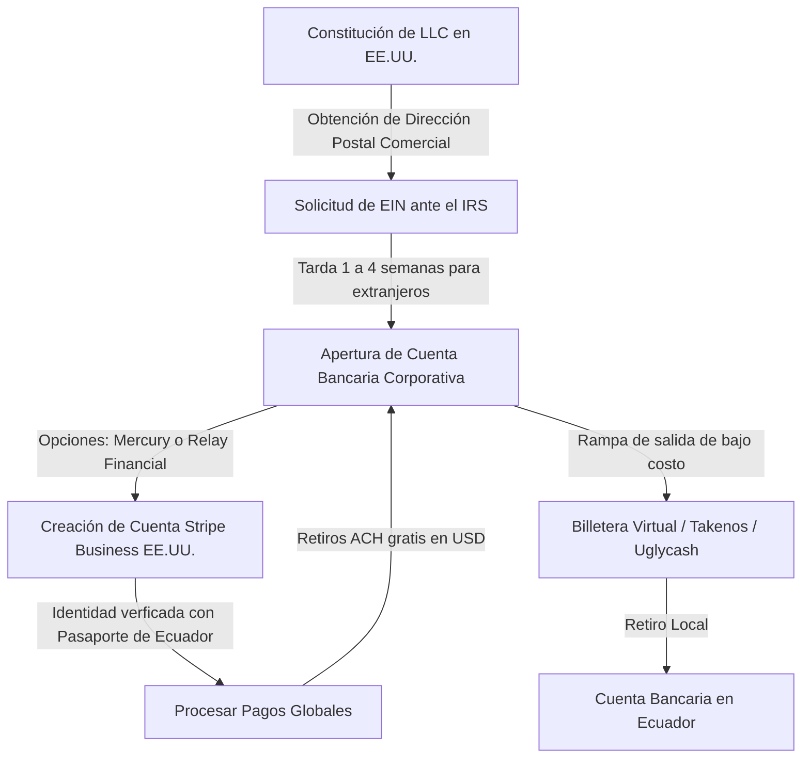

# Viabilidad de Stripe en Ecuador: Cuentas USA (Uglycash/Takenos) y la vía LLC

Este informe analiza de forma técnica y legal la posibilidad de implementar **Stripe** como pasarela de pago para un productor o negocio digital basado en **Ecuador**, utilizando cuentas bancarias virtuales de EE.UU. (como las provistas por fintechs tipo **Takenos** o **Uglycash**), y detalla los requisitos formales de registro.

---

## 1. El Veredicto: ¿Es viable usar Stripe directamente con cuentas de Takenos o Uglycash?

> [!CAUTION]
> **No es viable de forma directa como persona natural.** 
> Intentar registrar una cuenta de Stripe en EE.UU. como individuo (Sole Proprietorship) utilizando una dirección virtual y los datos bancarios de Takenos o Uglycash resultará en la **suspensión permanente de la cuenta** y la congelación de los fondos en el corto plazo.

### ¿Por qué falla este método?
*   **Verificación de Identidad (KYC):** Stripe EE.UU. exige que las personas físicas residan legalmente en los Estados Unidos. Durante el registro o al procesar los primeros cobros, Stripe solicitará un número de Seguro Social (**SSN**) o un número de Identificación de Contribuyente Individual (**ITIN**).
*   **Prueba de Domicilio:** Stripe requiere un comprobante de domicilio residencial físico en EE.UU. (por ejemplo, una factura de servicios públicos o un extracto bancario de un banco físico tradicional a tu nombre en una dirección real de EE.UU.). Los casilleros postales o direcciones virtuales de reenvío de correo son detectados y rechazados por sus sistemas de prevención de fraude.
*   **Naturaleza de Takenos/Uglycash:** Estas fintechs proveen cuentas bancarias de tránsito (ACH) a nombre de sus intermediarios financieros con subcuentas para los usuarios. Aunque sirven para recibir transferencias de Stripe, **no sirven para validar la residencia fiscal ni la identidad legal del titular ante Stripe**.

---

## 2. El Camino Viable y Legal: Crear una LLC en EE.UU.

Para utilizar Stripe residiendo en Ecuador de forma legítima, el usuario debe operar a través de una **entidad jurídica corporativa estadounidense (LLC o C-Corp)**. Stripe permite explícitamente a no residentes de EE.UU. abrir cuentas comerciales si son propietarios de una empresa constituida en ese país.

### Flujo de Registro Corporativo (Paso a Paso)

### Requisitos y Comparativa de Registro

#### Opción A: LLC Propietaria (Recomendada)
*   **Constitución:** Se crea una LLC (Sociedad de Responsabilidad Limitada) en un estado fiscalmente amigable para no residentes, como **Wyoming, Nuevo México o Delaware** (Wyoming y Nuevo México tienen costos anuales muy bajos). Se puede hacer a través de plataformas como *Doola*, *Firstbase* o *Formations* por un costo de entre $150 y $300 USD más tasas estatales.
*   **Identificación Fiscal (EIN):** La LLC obtiene un **EIN (Employer Identification Number)** del IRS de EE.UU. Este número actúa como el equivalente al RUC de la empresa y es el que se ingresa en Stripe. **No se requiere SSN ni ITIN personal**.
*   **Verificación de Propietario (UBO):** Al registrar la cuenta de Stripe Business, el usuario se identifica como el beneficiario final utilizando su **pasaporte ecuatoriano** y su **dirección física real en Ecuador**. Stripe acepta esto como legal y legítimo.
*   **Impuestos:** Si la LLC es de un solo miembro no residente y no tiene empleados, oficinas ni servidores físicos en EE.UU. (lo que se conoce como *ETBUS - Engaged in Trade or Business in the US*), la LLC se considera una entidad transparente ("disregarded entity") y no tributa impuesto sobre la renta federal en EE.UU., solo debe presentar formularios informativos anuales (Form 5472 y 1120).

#### Opción B: Stripe Atlas (C-Corp)
*   **Constitución:** Stripe ofrece su servicio **Stripe Atlas** por un costo de $500 USD. Este servicio constituye una corporación de tipo **C-Corp en Delaware**, tramita el EIN y abre la cuenta de Stripe de forma automatizada.
*   **Consideración de Negocio:** Una C-Corp en Delaware está diseñada para startups tecnológicas que buscan levantar capital de inversionistas de capital de riesgo (VCs). Implica una carga fiscal y contable compleja en EE.UU. (impuesto corporativo plano del 21% más impuestos estatales de Delaware), por lo que **no se recomienda** para un productor musical independiente o freelancer ecuatoriano.

---

## 3. Rol de Uglycash y Takenos en el Flujo de la LLC

Aunque no se pueden usar para registrar la cuenta de Stripe, estas plataformas son herramientas excelentes en la **fase de retiro de fondos (rampa de salida / off-ramp)**:

1.  **Banca Principal de la LLC:** Tras constituir la LLC, se abre una cuenta de banco comercial real en EE.UU. usando **Mercury Bank** o **Relay Financial** (ambas plataformas abren cuentas a no residentes de forma gratuita).
2.  **Vinculación en Stripe:** Stripe deposita las ventas diarias de forma automática y gratuita (ACH) en la cuenta de Mercury/Relay de la LLC.
3.  **Transferencia a Ecuador:** En lugar de hacer una transferencia internacional SWIFT desde Mercury a un banco en Ecuador (que cobra entre $20 y $35 por envío, más las altas tarifas de recepción de los bancos ecuatorianos), el usuario realiza una transferencia doméstica ACH local hacia su cuenta virtual de **Takenos** o **Uglycash**.
4.  **Monetización:** Takenos o Uglycash reciben el dinero en EE.UU. y permiten al usuario ecuatoriano retirar sus fondos directamente a su cuenta bancaria local en Ecuador (Banco Pichincha, Guayaquil, etc.) con comisiones mucho menores y de forma rápida.

---

## 4. Alternativas sin Crear una LLC en EE.UU.

Si el usuario no desea asumir los costos de constitución de una LLC ($200-$400 iniciales más unos $150 anuales de mantenimiento) ni las obligaciones fiscales informativas en EE.UU., se recomiendan las siguientes alternativas locales de procesamiento de pagos:

### A. PayPhone Business (Ecuador)
*   **Cómo funciona:** Pasarela de pago ecuatoriana para cobrar con tarjetas locales e internacionales.
*   **Comisión:** 5% por transacción con tarjeta (0% saldo a saldo).
*   **Retiro:** Gratis e inmediato a cualquier banco en Ecuador.
*   **Factibilidad:** **Excelente** para ventas locales. La fricción es que el comprador internacional debe pasar por una validación de seguridad (OTP) que a veces falla con tarjetas de bancos fuera de Latinoamérica.

### B. PayPal Business + Alianza Banco Pichincha
*   **Cómo funciona:** Se integra el botón de PayPal estándar en la tienda de beats.
*   **Comisión:** 5.4% + $0.30 USD por venta de beat.
*   **Retiro:** A través de la alianza directa de **Banco Pichincha**, que cobra una **tarifa plana de $10 USD por cada retiro**, sin importar el monto.
*   **Factibilidad:** **Alta** para el mercado internacional. La limitación es que para retirar montos pequeños (como una licencia básica de $30), la tarifa plana de $10 representa un 33% de costo de retiro, por lo que es necesario acumular saldo antes de retirar.

### C. dLocal Go
*   **Cómo funciona:** Pasarela regional para mercados emergentes que opera localmente en Ecuador.
*   **Factibilidad:** **Media-Alta**. Permite cobrar con tarjetas de débito/crédito locales y transferencias directas en Ecuador sin constituir empresa en EE.UU., con tasas competitivas y liquidación directa en el banco local.

---

## 🛠️ Implementación Técnica
*   **Decisión de Checkout:** [[3_Recursos/Codigo_Beatss/checkout.js]] (Se inhabilitó por completo la opción de pago de Stripe para la cuenta del productor principal, redirigiendo el flujo exclusivamente a PayPhone y Deuna!).
*   **Configuración del Proveedor:** [[3_Recursos/Codigo_Beatss/config.js]] (Definición de las pasarelas activas para procesamiento local e internacional sin depender de Stripe).
*   **Validación de Transacciones:** [[3_Recursos/Codigo_Beatss/api/payments/payphone/webhook.js]] y [[3_Recursos/Codigo_Beatss/api/payments/deuna/webhook.js]] (Operación y liquidación local con RUC en Ecuador).

