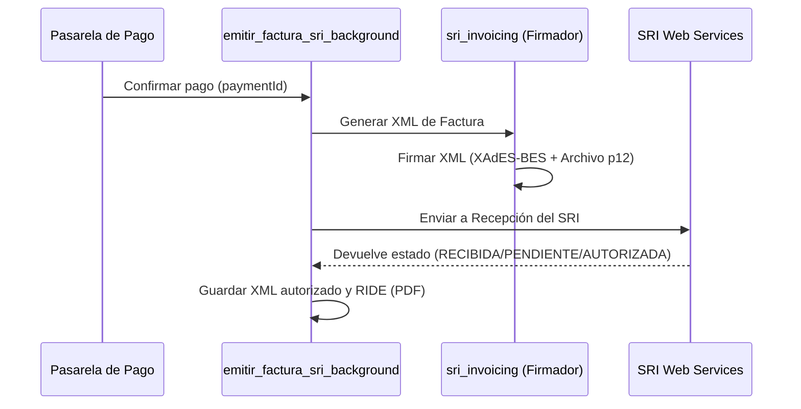

# Facturación electrónica del SRI (Ecuador) en BEATSS

## Modo operativo vigente: manual

BEATSS conserva el historial de ventas y prepara los datos de una operación.
Para el proceso completamente manual, la emisión, firma y envío se realizan en
el [Facturador SRI oficial](https://www.sri.gob.ec/facturador-sri). Después,
desde **Facturación SRI**, se pueden asociar a la venta elegida el XML
autorizado y el RIDE PDF descargados del SRI. Los archivos quedan en Storage
privado, con huellas de integridad y acceso autenticado.

El modo preferido es elegir una operación Live en **Facturación SRI** y pulsar
**Emitir esta venta en SRI**. BEATSS genera, firma y envía únicamente esa
factura después de confirmación expresa; no factura automáticamente al cobrar.
La emisión se ejecuta en esa petición autenticada y acotada a la venta elegida:
no requiere un worker persistente ni un heartbeat. Sí requiere pago aprobado
Live, sesión del productor propietario, configuración fiscal y firma privada
válidas, ambiente `2` y las rutas serverless desplegadas con acceso administrativo
a Firestore. El worker persistente sólo sirve para procesar/reintentar una cola
asíncrona; cuando se usa, ignora trabajos no seleccionados. Si falta la
configuración o el endpoint no está disponible, la emisión debe detenerse; como
alternativa, usa el Facturador SRI oficial y luego asocia sus archivos.

La ficha preparada por BEATSS **no es una factura**. Antes de emitir se deben
confirmar el pago, la identificación del comprador, la fecha, el concepto y la
tarifa tributaria aplicable. Los campos faltantes se marcan expresamente como
`PENDIENTE DE COMPLETAR`; nunca se inventan datos fiscales.

Después de emitir manualmente, usa “Asociar XML + RIDE” en la fila de esa venta
para guardarlos y descargarlos desde BEATSS. Los archivos adjuntados aparecen
como `ARCHIVOS MANUALES · REVISAR`, no como `AUTORIZADO`. Antes de guardarlos,
BEATSS exige una respuesta de autorización con estado `AUTORIZADO`, coteja la
clave autorizada con la clave del XML de factura, exige RUC emisor coincidente,
tipo factura, identificación del comprador cuando está registrada e importe
total igual al de la venta. El RIDE sólo se valida como PDF; no se coteja su
contenido visual con el XML. Nada de esto valida criptográficamente la firma ni
consulta al SRI para demostrar autenticidad. Confirma autorización, concepto y
RIDE en el portal del SRI antes de confiar en el registro.

Después de esa comparación, la fila ofrece **Confirmé revisión en SRI**.
BEATSS comprueba que los dos objetos privados sigan presentes y que coincidan
con sus huellas SHA-256, y registra el usuario y la hora de tu confirmación.
El nuevo estado `ARCHIVOS_MANUALES_VERIFICADOS` significa únicamente
**revisión humana confirmada**; nunca se convierte en `AUTORIZADO`, no prueba
la autenticidad criptográfica y bloquea volver a importar o emitir encima de
esa misma operación. Los archivos quedan descargables desde el historial.

La emisión automática por cada pago sigue desactivada: una preferencia antigua
no basta para encolar nada. La acción de emisión es individual, registra quién
la confirmó y cuándo, y procesa sólo esa operación. El worker persistente no es
un requisito para esta ejecución puntual.

## Opción por código, bajo demanda

La vista **Facturación SRI** permite seleccionar un pago aprobado y Live, y
confirmar una emisión puntual en ambiente `2`; la ruta web valida sesión,
propiedad, selección explícita y configuración antes de procesar sólo esa
operación. No consulta el heartbeat para habilitarla. Los estados de espera de
otros flujos asíncronos significan que **no se ha enviado nada al SRI** hasta que
un ejecutor procese el trabajo. No se requiere GitHub Actions ni un servicio
permanente para esta ruta web. El firmador y el flujo de autorización usados
son los que ya contiene BEATSS; no se agregó otro proyecto externo.

Desde la raíz del repositorio, con dependencias Python instaladas y una sesión
administrativa legítima de Firebase/gcloud disponible en el entorno:

```sh
python scripts/sri-once.py --payment-id ID_INTERNO_DEL_PAGO
```

La primera ejecución **sólo lee** el pago y su trabajo, comprueba que el pago
está aprobado, no es sandbox, corresponde al mismo productor y no tiene una
factura autorizada o pendiente de conciliación. No imprime datos del cliente.
Para hacer una prueba controlada en **ambiente 1**, después de revisar la
configuración y el certificado, se requiere una segunda invocación explícita:

```sh
python scripts/sri-once.py --payment-id ID_INTERNO_DEL_PAGO --issue --expected-environment 1 --confirm ISSUE:ID_INTERNO_DEL_PAGO
```

El proceso sólo lee/procesa el trabajo indicado y no ejecuta la cola completa
ni la cola local de contingencia. Por defecto el motor permite únicamente el
ambiente 1. El ambiente 2 exige autorizarlo deliberadamente con
`SRI_WORKER_ALLOWED_AMBIENTES=2` **y** confirmarlo en la invocación; no debe
hacerse hasta validar en pruebas la recepción, autorización, XML, RIDE y
descargas. Un estado `PENDING`/`CONTINGENCY` no significa factura autorizada.
No se debe volver a emitir un trabajo en estado de error sin conciliación.

El modo preferido de BEATSS es **manual por operación**: desde `/facturacion`,
el productor elige una venta aprobada y confirma expresamente si quiere que
BEATSS genere, firme y envíe esa factura al SRI. No se genera una factura por
cobrar ni se recorren ventas no seleccionadas. La ruta web requiere ambiente 2
y firma privada, pero no un heartbeat de worker. Los trabajos que no lleven la
marca de selección manual del propietario nunca son consumidos por el worker
persistente. Si se emitió por fuera de BEATSS, se puede asociar el XML
autorizado y RIDE a la fila correspondiente; esos adjuntos quedan como
pendientes de verificación humana y no se rotulan `AUTORIZADO` por BEATSS.

El [Facturador SRI oficial](https://www.sri.gob.ec/facturador-sri) queda como
alternativa para una emisión externa/manual. La ficha de BEATSS sólo prepara
datos; no es factura ni acredita el cumplimiento fiscal.

## Motor automático disponible pero desactivado

## 🧾 Flujo de Emisión de Facturas



## 🛠️ Endpoints y Controladores

*   `/facturacion`: panel privado para revisar estados, filtrar operaciones y
    descargar el RIDE/XML autorizado o solicitar un reintento.
*   `/api/payments/retry-sri`: registra una solicitud manual para un pago aprobado; si no hay ejecutor conectado, informa que queda a la espera de operación puntual.
*   `sri_invoicing.py`: Biblioteca que construye el XML y firma la estructura usando llaves criptográficas (.p12).
*   `sri_service.py`: Controla la cola en segundo plano (`emitir_factura_sri_background`) y realiza las peticiones SOAP a los Web Services del SRI (Pruebas y Producción).
*   La confirmación PayPal registra el pago y la licencia en Firestore, y crea
    un trabajo en `sriJobs` para que la factura también aparezca en el historial
    del dashboard.

La canonicalización XML de la firma se realiza en memoria con `lxml`; el flujo
no depende de `xmllint` ni de un binario instalado en el equipo.

## Configuración segura

La configuración pública del productor contiene únicamente datos fiscales y de
presentación. El certificado `.p12/.pfx` en Base64 y su contraseña se guardan
en `users/{uid}/private_config/producer`; en desarrollo, la copia local se
separa por `producerId`. Nunca deben quedar en `localStorage`, en el documento
público ni en el repositorio.

La dirección matriz debe coincidir con la dirección registrada en el RUC vigente
del emisor. Se almacena en la configuración privada del productor, no se fija en
el código fuente ni se sustituye por una ciudad genérica. El RUC del emisor no
tiene un valor predeterminado: debe configurarse explícitamente.

La tarifa de IVA ya no está fijada a 0% en el código. Se configura por productor
(`sriIvaTarifa`) con los códigos del esquema electrónico del SRI y, por defecto,
se considera que el precio publicado incluye IVA para que el total facturado
coincida con el cobro. La tarifa debe confirmarse según el régimen del emisor y
la naturaleza de la licencia antes de producción; la aplicación no sustituye
la revisión tributaria profesional.

El panel distingue `Pruebas` de `Producción`: los comprobantes emitidos en
pruebas sirven para validar el XML y el flujo técnico, pero no tienen validez
tributaria. La producción solo debe activarse después de que el emisor tenga
la autorización correspondiente y se haya revisado el certificado vigente.

## Autorización y contingencia

La recepción y la autorización son fases distintas. Si el SRI aún no devuelve
la autorización, BEATSS conserva el comprobante como
`PENDIENTE_AUTORIZACION`; una consulta posterior explícita vuelve a consultar la
misma reserva/clave, sin reenviar a ciegas otra factura. El worker persistente
puede hacer seguimiento asíncrono, pero no es necesario para que el productor
inicie manualmente la emisión desde una venta elegida. El XML/RIDE autorizado se
guarda en Storage privado y se descarga mediante rutas autenticadas; Firestore
conserva el estado y los metadatos, no se depende de una ruta local efímera.

Si faltan el RUC, el certificado o la contraseña, el trabajo queda en
`NO_CONFIGURADO` y no se reintenta en bucle. Si una factura se autoriza desde
la cola local, el mismo trabajo remoto se marca como `DONE` para evitar una
segunda emisión.

En producción, `/api/payments/retry-sri` registra la selección y
`/api/sri-issue` ejecuta de inmediato sólo esa venta con la sesión autenticada;
no espera al worker ni a un heartbeat. La función necesita acceso administrativo
a Firestore y a las credenciales privadas del emisor. Vercel puede alojar este
handler serverless de duración acotada, pero no debe usarse como worker de larga
duración. El worker persistente puede autenticarse con `FIREBASE_CLIENT_EMAIL` y
`FIREBASE_PRIVATE_KEY`; no depende de que `gcloud` esté instalado.

En desarrollo, `run.sh` deja el worker desactivado por defecto para evitar que
abrir la web envíe comprobantes al SRI. Para procesar una cola de forma
intencional, inicia el servidor con `ENABLE_SRI_CONTINGENCY_WORKER=true` y
verifica primero el ambiente (`1` pruebas, `2` producción) y la configuración
fiscal guardada.

El proceso persistente debe arrancar con `python -u sri_worker.py` o con
`Dockerfile.sri-worker`. Por defensa adicional, el worker solo permite el
ambiente `1` por defecto. `SRI_WORKER_ALLOWED_AMBIENTES=2` es un desbloqueo
explícito de producción. Las solicitudes manuales de BeatSS se procesan desde
`sriJobs` sólo si llevan `manualIssueRequested=true`; la cola SQLite heredada
también coteja esa marca con el pago aprobado y su productor. Los trabajos
antiguos o no seleccionados se conservan sin ejecutarse. Los trabajos de un
ambiente no autorizado permanecen intactos y no adquieren lease ni modifican
el pago.

Antes de producción:

1. Publicar las reglas de `firestore.rules`.
2. Configurar el certificado y RUC reales del emisor en la cuenta correcta.
3. Desplegar las funciones serverless. El worker persistente es opcional para
   seguimiento automático de colas; no hace falta para emitir una venta puntual.
4. Probar en ambiente SRI de pruebas y revisar XML, autorización, RIDE y descarga.
5. Cambiar a producción únicamente después de validar el flujo completo.

---
*Relacionado:* [[docs/10_Pagos/README]] | [[Dashboard BEATSS]]
