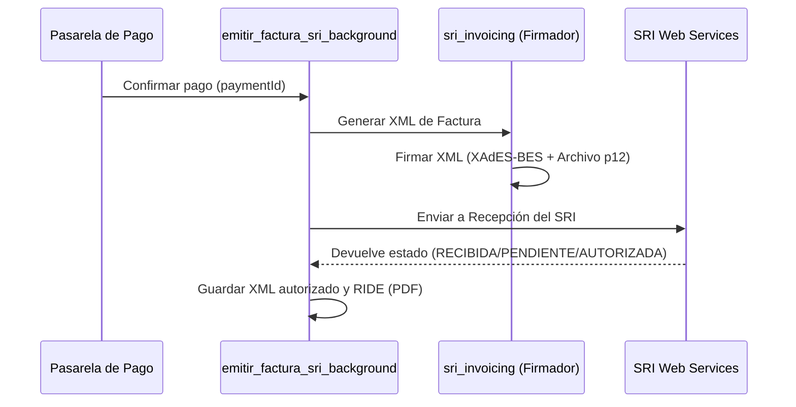

# Facturación electrónica del SRI (Ecuador) en BEATSS

Automatiza la emisión de facturas electrónicas de contingencia con firma XAdES-BES en cumplimiento de las normativas de la República del Ecuador.

## 🧾 Flujo de Emisión de Facturas

## 🛠️ Endpoints y Controladores

*   `/facturacion`: panel privado para revisar estados, filtrar operaciones y
    descargar el RIDE/XML autorizado o solicitar un reintento.
*   `/api/payments/retry-sri`: Endpoint manual para re-intentar la emisión de una factura que falló durante el cobro inicial.
*   `sri_invoicing.py`: Biblioteca que construye el XML y firma la estructura usando llaves criptográficas (.p12).
*   `sri_service.py`: Controla la cola en segundo plano (`emitir_factura_sri_background`) y realiza las peticiones SOAP a los Web Services del SRI (Pruebas y Producción).
*   La confirmación PayPal registra el pago y la licencia en Firestore, y crea
    un trabajo en `sriJobs` para que la factura también aparezca en el historial
    del dashboard.

La canonicalización XML de la firma se realiza en memoria con `lxml`; el flujo
no depende de `xmllint` ni de un binario instalado en el equipo.

## Configuración segura

La configuración pública del productor contiene únicamente datos fiscales y de
presentación. El certificado `.p12/.pfx` en Base64 y su contraseña se guardan
en `users/{uid}/private_config/producer`; en desarrollo, la copia local se
separa por `producerId`. Nunca deben quedar en `localStorage`, en el documento
público ni en el repositorio.

La dirección matriz por defecto es `Quito - Ecuador` y debe sustituirse por la
dirección fiscal real del emisor antes de pasar a producción. El RUC del emisor
no tiene un valor predeterminado: debe configurarse explícitamente.

La tarifa de IVA ya no está fijada a 0% en el código. Se configura por productor
(`sriIvaTarifa`) con los códigos del esquema electrónico del SRI y, por defecto,
se considera que el precio publicado incluye IVA para que el total facturado
coincida con el cobro. La tarifa debe confirmarse según el régimen del emisor y
la naturaleza de la licencia antes de producción; la aplicación no sustituye
la revisión tributaria profesional.

El panel distingue `Pruebas` de `Producción`: los comprobantes emitidos en
pruebas sirven para validar el XML y el flujo técnico, pero no tienen validez
tributaria. La producción solo debe activarse después de que el emisor tenga
la autorización correspondiente y se haya revisado el certificado vigente.

## Autorización y contingencia

La recepción y la autorización son fases distintas. Si el SRI aún no devuelve
la autorización, BEATSS conserva el comprobante como
`PENDIENTE_AUTORIZACION` y lo reintenta mediante el worker persistente. El
RIDE y el XML autorizado se guardan en Firestore en Base64 para que los botones
de descarga funcionen aunque el archivo local ya no exista.

Si faltan el RUC, el certificado o la contraseña, el trabajo queda en
`NO_CONFIGURADO` y no se reintenta en bucle. Si una factura se autoriza desde
la cola local, el mismo trabajo remoto se marca como `DONE` para evitar una
segunda emisión.

En producción, `/api/payments/retry-sri` solo crea un trabajo en `sriJobs`.
Debe existir un proceso Python persistente con acceso administrativo a
Firestore y a las credenciales privadas del emisor para procesar esa cola.
Vercel no debe usarse como worker de larga duración.
El worker puede autenticarse con `FIREBASE_CLIENT_EMAIL` y
`FIREBASE_PRIVATE_KEY`; no depende de que `gcloud` esté instalado.

En desarrollo, `run.sh` deja el worker desactivado por defecto para evitar que
abrir la web envíe comprobantes al SRI. Para procesar una cola de forma
intencional, inicia el servidor con `ENABLE_SRI_CONTINGENCY_WORKER=true` y
verifica primero el ambiente (`1` pruebas, `2` producción) y la configuración
fiscal guardada.

Antes de producción:

1. Publicar las reglas de `firestore.rules`.
2. Configurar el certificado y RUC reales del emisor en la cuenta correcta.
3. Desplegar las funciones serverless y el worker persistente.
4. Probar en ambiente SRI de pruebas y revisar XML, autorización, RIDE y descarga.
5. Cambiar a producción únicamente después de validar el flujo completo.

---
*Relacionado:* [[docs/10_Pagos/README]] | [[Dashboard BEATSS]]
