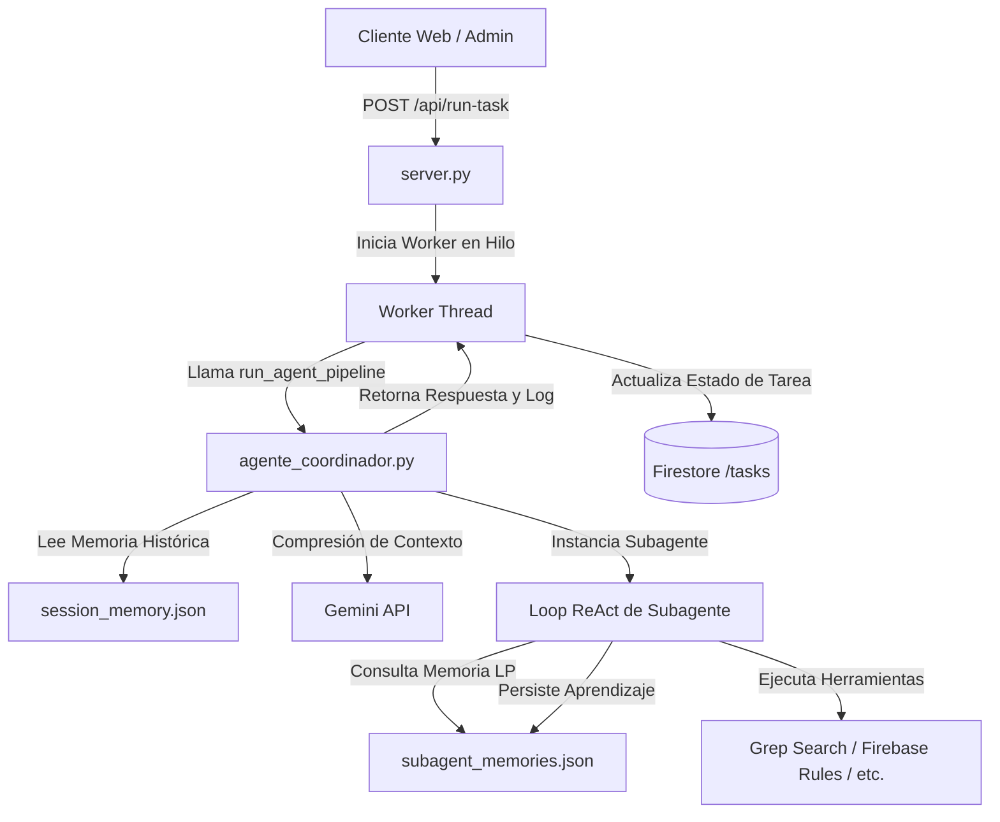

# Arquitectura "Agent OS" - Motor de Agentes Multi-Agente Asíncronos

Este documento describe la arquitectura de ejecución de agentes especializada de la plataforma **BEATSS**, que implementa un sistema operativo ligero para orquestar los 21 agentes de optimización en segundo plano con persistencia de memoria a largo plazo y gestión dinámica de tokens.

---

## 🏗️ Estructura del Componente Backend

La lógica central de agentes reside en:
1. **[`agente_coordinador.py`](file:///Users/sossa/IA/generador-licencias/agente_coordinador.py)**: Orquestador central (Router, Director de Proyecto) y loop ReAct para subagentes.
2. **[`server.py`](file:///Users/sossa/IA/generador-licencias/server.py)**: Servidor web API de comunicación con el frontend de administración, implementando un Worker asíncrono para ejecutar tareas pesadas de agentes en hilos secundarios.



---

## 🧠 Flujo de Ejecución y Gestión de Memoria

### 1. Compresión Inteligente de Tokens (Token Management)
Para evitar el desbordamiento de contexto de las llamadas a la API de Gemini, `agente_coordinador.py` implementa `summarize_history_if_needed(history)`:
* **Condición de Compresión**: Si el historial de chat de la sesión actual supera las **8 interacciones**.
* **Mecanismo**: Gemini sintetiza las primeras interacciones en un resumen ejecutivo conciso de 4 líneas.
* **Pipeline de Contexto**: Se inyecta el resumen seguido únicamente de los últimos **4 mensajes**, liberando más del 60% del espacio de tokens y manteniendo el foco en el flujo actual.

### 2. Pipeline de Ejecución Modular (`run_agent_pipeline`)
Encapsula el flujo completo de enrutamiento y ejecución:
```python
def run_agent_pipeline(user_prompt, callback=None):
    # 1. Recuperar historial y aplicar compresión
    # 2. El Agente Enrutador determina si requiere un Subagente
    # 3. El Agente Coordinador (Director) refina el plan de trabajo
    # 4. Se ejecuta el subagente seleccionado en un loop ReAct
    # 5. Se capturan y persisten sus aprendizajes
```

### 3. Persistencia de Memoria a Largo Plazo
* **Memoria de Sesión (`session_memory.json`)**: Mantiene el hilo de conversación global del usuario con el coordinador de licencias.
* **Memoria de Subagente (`subagent_memories.json`)**: Almacena hallazgos clave de cada uno de los subagentes técnicos tras resolver tareas (v.g. qué archivos modificó `refactor_expert`, qué problemas de CORS resolvió `integrator`, etc.), permitiéndoles "recordar" el contexto en ejecuciones futuras.

---

## ⚡ Worker Asíncrono en Segundo Plano (`server.py`)

Para no bloquear el hilo principal del servidor web ante tareas de agentes que pueden tomar varios minutos (ej. auditorías de seguridad completas o refactorizaciones complejas):
1. **Endpoint `POST /api/run-task`**: Registra la solicitud del cliente, genera un identificador único, crea un registro de seguimiento en Firestore en la colección `/tasks` con estado `"pending"`, e inicia un hilo secundario (`threading.Thread`).
2. **Callbacks en Tiempo Real**: Durante la ejecución, el worker escribe logs de progreso e informes intermedios directamente en el documento de Firestore de la tarea.
3. **Persistencia Final**: Al terminar, el worker cambia el estado de la tarea a `"completed"` o `"failed"`, adjuntando el markdown final con las propuestas del agente en Firestore para visualización en el frontend.
