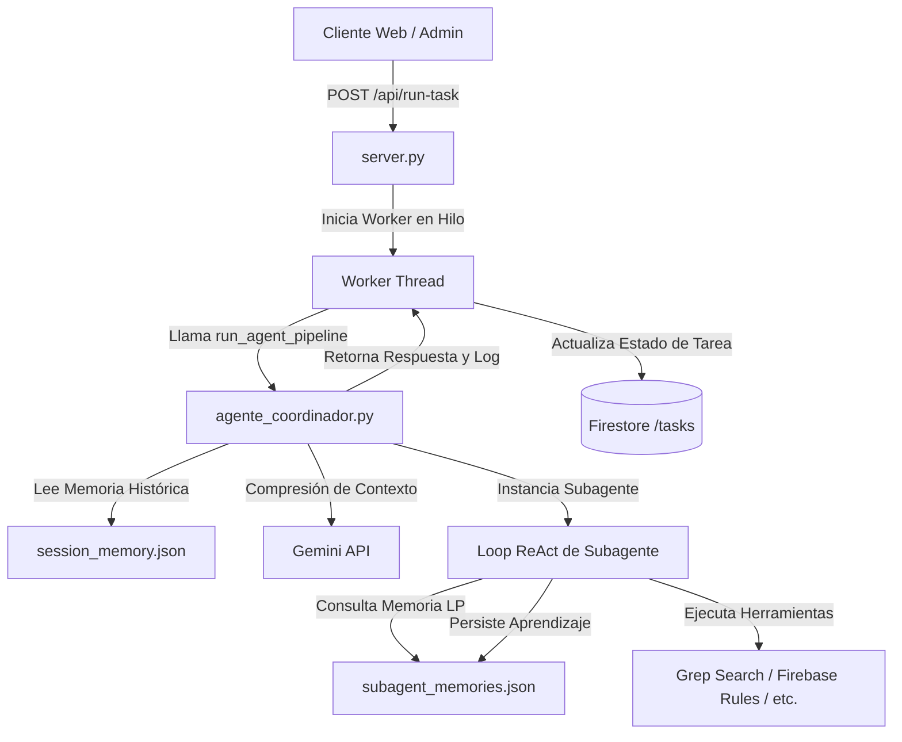

# Arquitectura "BEATSS Project OS" - Motor de Agentes Multi-Agente Asíncronos

Este documento describe la arquitectura de ejecución de agentes de **BEATSS**.
"Project OS" es una metáfora: no es un sistema operativo del computador, sino
la capa que coordina agentes, tareas, herramientas, memoria y síntesis.

La raíz activa es `/Users/sossa/Documents/Codex/BeatSS`. El sistema actual
cuenta con 24 roles y la memoria nueva se aísla por `user_id`, `task_id` y
`project_id` en `.beatss_memory/`; los JSON antiguos solo se leen como
migración compatible y no se eliminan automáticamente.

---

## 🏗️ Estructura del Componente Backend

La lógica central de agentes reside en:
1. **`agente_coordinador.py`**: Orquestador central para CLI y compatibilidad.
2. **`agent_manager.py`**: Router, Director, loop ReAct y herramientas locales seguras.
3. **`memory_manager.py`**: Memoria aislada, versionada y con escritura atómica.
4. **`handlers_post.py`**: Worker HTTP que pasa `userId` y `taskId` al pipeline.

Las rutas que apunten a `/Users/sossa/IA/generador-licencias` son referencias
históricas de la migración y no deben usarse para leer ni escribir.



---

## 🧠 Flujo de Ejecución y Gestión de Memoria

### 1. Compresión Inteligente de Tokens (Token Management)
Para evitar el desbordamiento de contexto de las llamadas al LLM, `memory_manager.py`
implementa `summarize_history_if_needed(history, context)`:
* **Condición de Compresión**: Si el historial de chat de la sesión actual supera las **8 interacciones**.
* **Mecanismo**: El proveedor activo genera un resumen de hasta 8 líneas y se persiste con su cantidad de turnos de origen.
* **Recuperación**: Se combinan el resumen, los últimos turnos y recuerdos relevantes por términos antes de llamar al Router.

### 2. Seguridad e integridad de memoria

* Cada usuario y tarea obtiene archivos separados; una tarea sin `userId` usa
  un identificador derivado de su propio `taskId`.
* Las escrituras usan lock de proceso/sistema, archivo temporal, `fsync` y
  `os.replace`.
* Las memorias de subagentes conservan versiones recientes en vez de
  sobrescribir el único texto anterior.
* Las herramientas de archivos solo permiten BeatSS y la bóveda BeatSS para
  lectura; escritura solo está permitida dentro de BeatSS.
* Se excluyen `.env`, certificados, claves, cuentas de servicio, respaldos y
  memorias privadas de lectura y búsqueda.

### 3. Pipeline de Ejecución Modular (`run_agent_pipeline`)
Encapsula el flujo completo de enrutamiento y ejecución:
```python
def run_agent_pipeline(user_prompt, callback=None):
    # 1. Recuperar historial y aplicar compresión
    # 2. El Agente Enrutador determina si requiere un Subagente
    # 3. El Agente Coordinador (Director) refina el plan de trabajo
    # 4. Se ejecuta el subagente seleccionado en un loop ReAct
    # 5. Se capturan y persisten sus aprendizajes
```

### 4. Persistencia de Memoria a Largo Plazo
* **Memoria de Sesión**: Mantiene turnos, resumen persistente y contexto de
  usuario/tarea/proyecto.
* **Memoria de Subagente**: Almacena el recuerdo actual y versiones recientes
  por rol, con fecha y fuente.
* **Migración**: `session_memory.json` y `subagent_memories.json` son formatos
  legacy; se preservan y solo se consultan al iniciar el contexto local por
  primera vez.

---

## ⚡ Worker Asíncrono en Segundo Plano

Para no bloquear el hilo principal del servidor web ante tareas de agentes que pueden tomar varios minutos (ej. auditorías de seguridad completas o refactorizaciones complejas):
1. **Endpoint `POST /api/run-task`**: Registra la solicitud del cliente, genera un identificador único, crea un registro de seguimiento en Firestore en la colección `/tasks` con estado `"pending"`, e inicia un hilo secundario (`threading.Thread`).
2. **Callbacks en Tiempo Real**: Durante la ejecución, el worker escribe logs de progreso e informes intermedios directamente en el documento de Firestore de la tarea.
3. **Persistencia Final**: Al terminar, el worker cambia el estado de la tarea a `"completed"` o `"failed"`, adjuntando el markdown final con las propuestas del agente en Firestore para visualización en el frontend.
