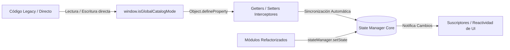

# Arquitectura de Gestión de Estado - Frontend Modular

Este documento detalla la estructura y el funcionamiento del **StateManager** de la aplicación **BEATSS**, implementado para centralizar el flujo de datos, resolver problemas de dependencias circulares y proporcionar sincronización bidireccional transparente con el entorno legacy.

---

## 🔍 Contexto y Motivación

En la arquitectura original de BEATSS, los estados críticos de la interfaz (como la vista activa, el estado del carrito, si el usuario está en el catálogo global o en la tienda del productor) se gestionaban mediante variables asignadas directamente al objeto global `window`.

### Problemas Detectados:
1. **Fugas de Estado**: Navegar entre la landing page, el panel del productor y el catálogo global dejaba remanentes de estado (ej. el carrito flotante visible incorrectamente).
2. **Dependencias Circulares**: Los módulos (`catalog.js`, `checkout.js`, `main.js`) necesitaban interactuar entre sí constantemente, lo que complicaba la inicialización en orden correcto.
3. **Falta de Reactividad**: Para actualizar el DOM al cambiar un estado global, se dependía de llamadas manuales a funciones de actualización (v.g. `updateCartUI()`), propensas a omitirse.

---

## 🛠️ Solución Técnica: State Manager Reactivo y Retrocompatible

El archivo **[`stateManager.js`](file:///Users/sossa/IA/generador-licencias/stateManager.js)** implementa una arquitectura híbrida única: un almacén central de patrón **Pub/Sub** combinado con interceptores dinámicos en el objeto `window`.



### 1. Intercepción Transparente mediante `Object.defineProperty`
Para garantizar retrocompatibilidad total sin romper código antiguo o submódulos que aún utilicen sintaxis directa sobre `window`, el constructor del `StateManager` redefine las propiedades clave en `window`:

```javascript
Object.keys(this.state).forEach(key => {
  // 1. Adoptar valores iniciales si ya existían en window
  if (window[key] !== undefined) {
    this.state[key] = window[key];
  }
  
  // 2. Redefinir propiedad con Get / Set
  Object.defineProperty(window, key, {
    get: () => this.state[key],
    set: (value) => {
      this.setState(key, value); // Invoca la reactividad del Pub/Sub
    },
    configurable: true,
    enumerable: true
  });
});
```
*Cualquier mutación como `window.isGlobalCatalogMode = false;` ejecutada por archivos legados es interceptada automáticamente por el StateManager, actualizando el almacén y disparando a todos los componentes suscritos.*

### 2. Patrón Pub/Sub para Reactividad
Los componentes pueden suscribirse a cambios específicos para actualizar la interfaz dinámicamente:

```javascript
// Suscribirse a cambios en el carrito de compras
window.stateManager.subscribe('cart', (newCart, oldCart) => {
  console.log("El carrito cambió. Nuevos items:", newCart.length);
  updateCartUI();
});
```

---

## 📋 API del State Manager

* **`getState(key)`**: Obtiene el valor actual de una propiedad del estado de manera segura.
* **`setState(key, value)`**: Modifica el valor de una propiedad. Si el nuevo valor es diferente al anterior, actualiza el almacén y notifica a los suscriptores.
* **`updateState(updates)`**: Permite realizar múltiples cambios en una sola llamada pasando un objeto de actualizaciones (ej. `updateState({ isGlobalCatalogMode: false, isPublicStoreMode: true })`).
* **`subscribe(key, callback)`**: Registra un observador que se ejecuta al cambiar la propiedad especificada. Retorna una función para desuscribirse (`unsubscribe`).

---

## 🚀 Integración en index.html

El script se inyecta como un módulo JavaScript de primer nivel en **[`index.html`](file:///Users/sossa/IA/generador-licencias/index.html#L3038)**, justo antes de `main.js`, garantizando que el `stateManager` global esté inicializado y definido en `window` antes de que cualquier otro script intente acceder a él o registrar suscriptores:

```html
<!-- State Manager para control centralizado de flujos de navegación y reactividad -->
<script type="module" src="stateManager.js"></script>
<script type="module" src="main.js"></script>
```
