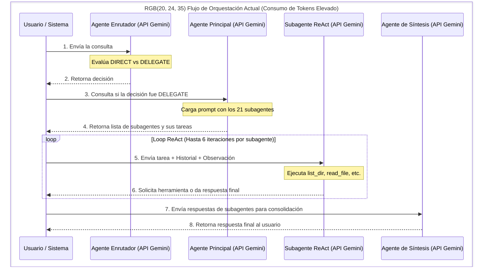

# Reporte de Optimización de Tokens y Gestión de Contexto - BEATSS

Este reporte presenta un análisis de la estructura del proyecto en `/Users/sossa/IA/generador-licencias` y el funcionamiento del script de orquestación `agente_coordinador.py`. El objetivo es proponer estrategias, refactorizaciones y herramientas concretas para la computadora de Sossa que permitan reducir drásticamente el consumo de tokens y evitar los cuellos de botella de la API de Gemini (como el error HTTP 429 - *Too Many Requests*).

---

## 1. Diagnóstico del Estado Actual

### 1.1 Estructura de `agente_coordinador.py`
El script coordinador utiliza una arquitectura multi-agente basada en el framework **ReAct (Reasoning + Acting)**. Su flujo operativo para una petición compleja sigue este recorrido:



**Problemas identificados en el script:**
1. **Llamadas redundantes y secuenciales:** Para consultas complejas, se realizan al menos dos llamadas iniciales (Enrutamiento + Delegación) antes de invocar a un especialista.
2. **Acumulación lineal de contexto en ReAct:** Al usar `read_file` sobre archivos de texto grandes, el contenido completo del archivo se añade a la conversación. En la iteración posterior del loop ReAct, este archivo masivo se vuelve a enviar al LLM, multiplicando innecesariamente el costo de tokens.
3. **Prompt de sistema ineficiente:** El prompt del `MAIN_AGENT_PROMPT` inyecta las descripciones detalladas de los **21 subagentes** en cada llamada de decisión, lo cual infla el prompt base con miles de tokens redundantes.

### 1.2 Archivos Monolíticos del Repositorio
La base de código del frontend de BEATSS presenta archivos sumamente pesados que exceden las capacidades de procesamiento eficiente de un LLM:
*   `index.html` (348 KB, ~4,000 líneas): Contiene estilos CSS integrados, animaciones SVG y la totalidad del DOM estructurado en un solo monolito.
*   `dashboard.js` (153 KB): Todo el panel de control del productor, estadísticas de Chart.js y cálculos en una sola pieza.
*   `editor.js` (149 KB): Lógica de carga de contratos y conversión de PDF.
*   `main.js` (149 KB) y `checkout.js` (115 KB): Lógicas de autenticación, catálogo y procesamiento de pagos concentradas en archivos masivos.

> [!WARNING]
> Cuando un subagente especializado ejecuta `read_file` sobre cualquiera de estos archivos, se golpea el límite de truncado (100KB en el script) perdiendo información esencial, o se satura el contexto consumiendo más de **35,000 tokens en una sola lectura**.

---

## 2. Recomendaciones de Optimización en `agente_coordinador.py`

### 2.1 Fusión de Enrutamiento y Coordinación (Ahorro: ~25% de peticiones API)
Se recomienda unificar el **Agente Enrutador** y el **Agente Principal** en un único paso inteligente. El modelo Gemini 2.5 Flash tiene suficiente capacidad para analizar la petición, decidir si requiere delegación y estructurar las subtareas de los especialistas de forma simultánea.

**Propuesta de estructura de respuesta unificada:**
```json
{
  "routing_decision": "DIRECT" | "DELEGATE",
  "pensamiento": "Razonamiento inicial...",
  "respuesta_directa": "Respuesta directa al usuario (si es DIRECT)",
  "delegados": [
    {
      "rol": "designer",
      "consulta": "Instrucciones de diseño..."
    }
  ]
}
```

### 2.2 Carga Dinámica de Especialidades en Subagentes
En lugar de describir a los 21 subagentes en el `MAIN_AGENT_PROMPT`, se debe utilizar un diccionario minimalista con el nombre del rol y una etiqueta simple de 5 palabras. El prompt extendido de cada subagente (definido en `SUBAGENT_PROMPTS`) solo debe cargarse cuando el coordinador ha elegido a ese subagente en particular y se inicializa su `execute_subagent_react_loop`.

### 2.3 Compresión del Historial ReAct (Limpieza de Contexto)
Actualmente, el historial guarda los archivos leídos completos de manera acumulativa:
`Prompt Inicial -> Respuesta (Usa Herramienta) -> Observación (100KB de archivo) -> Siguiente Respuesta -> Siguiente Observación...`

**Estrategia:** Una vez que el subagente ha procesado una observación de lectura de archivo (por ejemplo, en la iteración 2), el script debe "limpiar" esa observación de las llamadas 3 en adelante, sustituyéndola por una referencia corta como: `"[OBSERVACIÓN: Archivo 'dashboard.js' leído con éxito. Tamaño: 153KB (Contenido omitido en turnos posteriores para optimizar tokens)]"`. El agente ya habrá extraído el conocimiento necesario en el turno anterior.

### 2.4 Forzado de Lecturas Parciales por Rangos
Establecer un límite estricto en el script: si un archivo supera los 15 KB, la herramienta de lectura regular `read_file` debe rechazar la petición y exigirle al subagente que utilice `read_file_lines` especificando el rango de líneas de interés (por ejemplo, de la línea 150 a la 250).

---

## 3. Refactorización Modular del Repositorio

Para evitar que los subagentes consuman tokens excesivos, el código de BEATSS debe ser dividido en módulos que no superen las **300 líneas**. A continuación se presenta el plan de separación física:

| Archivo Monolítico | Tamaño | Propuesta de Submódulos Atómicos (Menores a 300 líneas) |
| :--- | :--- | :--- |
| **`dashboard.js`** | 153 KB | 1. `dashboard_ui.js` (Renderizado del layout y DOM)<br/>2. `dashboard_charts.js` (Instanciación de gráficos Chart.js)<br/>3. `dashboard_stats.js` (Fórmulas contables de MRR, LTV y splits) |
| **`editor.js`** | 149 KB | 1. `editor_templates.js` (Estructura base de contratos)<br/>2. `editor_pdf.js` (Configuración de exportación html2pdf)<br/>3. `editor_events.js` (Controladores de eventos y firmas) |
| **`checkout.js`** | 115 KB | 1. `checkout_paypal.js` (Inicialización de PayPal SDK)<br/>2. `checkout_payphone.js` (Integración pasarela PayPhone)<br/>3. `checkout_coupons.js` (Cálculo de impuestos y validación de cupones) |
| **`index.html`** | 348 KB | 1. Implementar un bundler (**Vite**) para modularizar en secciones HTML (`header.html`, `catalog.html`, `contracts.html`, `footer.html`) que se ensamblan en build time.<br/>2. Externalizar estilos a archivos CSS aislados o clases puras de Tailwind compiladas en local. |

---

## 4. Auditoría de Notas de Obsidian (Gestión de Conocimiento)

La bóveda de Obsidian en `/Users/sossa/IA/` actualmente contiene notas de documentación extensas que, si se leen de forma completa por el subagente `obsidian_expert`, causan un consumo de tokens innecesario.

### 4.1 Estrategia de Notas Atómicas
*   **Principio de Responsabilidad Única:** Cada nota en Obsidian debe centrarse en un único tema específico (por ejemplo, una nota para la configuración de PayPhone, otra para las credenciales del Sandbox de PayPal, etc.). El tamaño ideal debe ser **menor a 10 KB** (aproximadamente 2-3 páginas de texto).
*   **Enlaces Bidireccionales Intensivos:** En lugar de crear un reporte masivo, se debe estructurar una nota "hub" (como `Dashboard BEATSS.md`) que enlace mediante `[[nombre_nota]]` a las notas atómicas. De esta manera, el agente especialista en Obsidian puede navegar dinámicamente usando las referencias sin leer todo el cuerpo documental de golpe.

### 4.2 Verificación Automatizada del Tamaño de Notas
Se sugiere configurar el plugin comunitario **Linter** en Obsidian o utilizar el script de auditoría provisto en este reporte para alertar cuando un archivo `.md` de la bóveda supere las 1,500 palabras, sugiriendo su división.

---

## 5. Herramientas y Repositorios a Configurar en la Computadora de Sossa

Para resolver la raíz de los problemas (error 429 y consumo ineficiente), se recomienda la instalación y configuración de las siguientes herramientas de sistema en la Mac de Sossa:

### 5.1 Gemini Context Caching (Caché de Contexto)
La API de Gemini 2.5 cuenta con soporte nativo de **Context Caching**. Esto permite almacenar en los servidores de Google los datos estáticos que se repiten en cada llamada (como los system prompts complejos de los 21 agentes y los archivos principales del proyecto) por un costo mínimo o nulo de tokens en consultas repetitivas.

**Implementación técnica sugerida en `agente_coordinador.py`:**
Se debe migrar el cliente HTTP crudo a la librería oficial `google-genai` para habilitar el manejo de caché:

```python
# Ejemplo conceptual usando la SDK oficial de Google GenAI
from google import genai
from google.genai import types

client = genai.Client()

# Crear un caché para el contexto estático del repositorio
# (Aplica si el prompt del contexto supera los 32,768 tokens)
cache = client.caches.create(
    model="models/gemini-2.5-flash",
    config=types.CreateCachedContentConfig(
        contents=[
            # Aquí inyectamos los system prompts de los agentes y archivos core
            types.Content(parts=[types.Part.from_text(text=SYSTEM_INSTRUCTIONS_AND_CORE_FILES)])
        ],
        ttl="300s" # El caché vive 5 minutos y se renueva con la actividad
    )
)

# Realizar llamadas apuntando al caché creado
response = client.models.generate_content(
    model="models/gemini-2.5-flash",
    contents="Consulta del usuario...",
    config=types.GenerateContentConfig(
        cached_content=cache.name
    )
)
```

### 5.2 LiteLLM + Redis (Proxy Local y Rate Limiter)
[LiteLLM](https://github.com/BerriAI/litellm) es un proxy ligero que unifica las llamadas a diferentes APIs de modelos de lenguaje utilizando el estándar de OpenAI.
*   **¿Por qué instalarlo?** Permite configurar un límite local de llamadas por minuto (RPM) y solicitudes por día (RPD) mediante Redis.
*   **Beneficio:** En lugar de que `agente_coordinador.py` golpee directamente la API de Gemini y falle con un código 429, LiteLLM encola las peticiones localmente y las libera de forma controlada respetando las cuotas.
*   **Instalación rápida en macOS:**
    ```bash
    pip install 'litellm[proxy]'
    # Ejecutar el proxy local enlazado a Gemini
    litellm --model gemini/gemini-2.5-flash
    ```

### 5.3 Vite y PurgeCSS (Bundler Frontend)
Instalar y configurar [Vite](https://vite.dev/) en la computadora de Sossa para el desarrollo del generador de licencias.
*   **Beneficio:** Permite a Sossa programar de forma modular (dividiendo el HTML en componentes y el JS en submódulos pequeños). En la fase de compilación local (`npm run build`), Vite se encarga de unificar, purgar clases de CSS no usadas y minificar el código para producción.
*   **Resultado:** El código fuente se mantiene ultra atómico (fácil de leer y modificar para la IA) mientras que el archivo desplegado es ligero y de alto rendimiento.

### 5.4 `cloc` (Count Lines of Code)
Una herramienta CLI rápida para auditar el tamaño del código.
*   **Instalación:** `brew install cloc`
*   **Uso:** Sossa (o el agente coordinador) puede correr `cloc .` antes de una sesión para identificar qué archivos están creciendo demasiado y requieren ser divididos en módulos más pequeños de forma preventiva.

---

## 6. Script de Auditoría de Contexto (`sanity_check.py`)

Se ha diseñado un script de utilidad para la computadora de Sossa. Este script analiza el directorio del proyecto y la bóveda de Obsidian, generando alertas visuales sobre los archivos o notas que superan los límites recomendados de tamaño y líneas, lo que facilitará mantener el control del contexto de tokens.

El script se puede ubicar en `/Users/sossa/IA/generador-licencias/scratch/sanity_check.py`.

```python
import os

PROJECT_PATH = "/Users/sossa/IA/generador-licencias"
MAX_JS_LINES = 300
MAX_MD_SIZE_KB = 10.0

def check_files():
    print("=== AUDITORÍA DE CONTEXTO Y TAMAÑO DE ARCHIVOS ===")
    for root, dirs, files in os.walk(PROJECT_PATH):
        # Omitir dependencias
        if any(x in root for x in [".git", "node_modules", ".venv", ".vercel", "dist"]):
            continue
            
        for file in files:
            file_path = os.path.join(root, file)
            rel_path = os.path.relpath(file_path, PROJECT_PATH)
            
            # Comprobar JS
            if file.endswith(".js"):
                try:
                    with open(file_path, "r", encoding="utf-8") as f:
                        lines = f.readlines()
                    if len(lines) > MAX_JS_LINES:
                        print(f"⚠️  [JS Grande]: {rel_path} tiene {len(lines)} líneas (Límite sugerido: {MAX_JS_LINES})")
                except Exception:
                    pass
            
            # Comprobar notas de Obsidian
            elif file.endswith(".md"):
                size_kb = os.path.getsize(file_path) / 1024
                if size_kb > MAX_MD_SIZE_KB:
                    print(f"⚠️  [Nota Pesada]: {rel_path} mide {size_kb:.2f} KB (Límite sugerido: {MAX_MD_SIZE_KB} KB)")

if __name__ == "__main__":
    check_files()
```

> [!TIP]
> Integrar la ejecución de este script en la fase pre-commit de Git o ejecutarlo mediante el subagente `refactor_expert` asegurará que el repositorio nunca acumule código redundante o inmanejable para las inteligencias artificiales.
